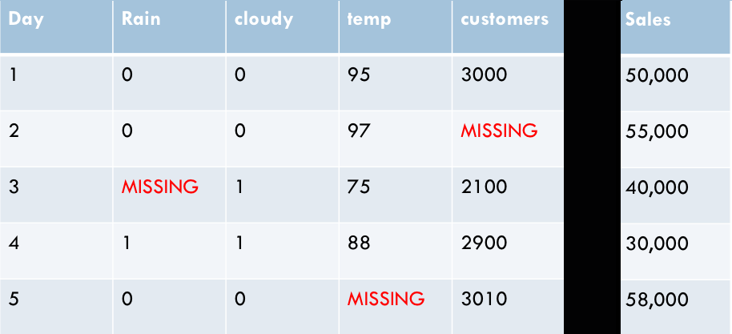
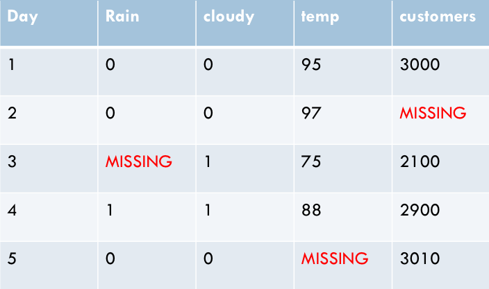
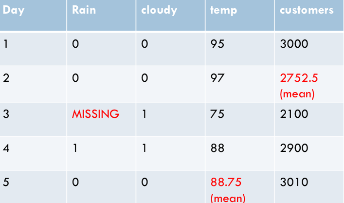
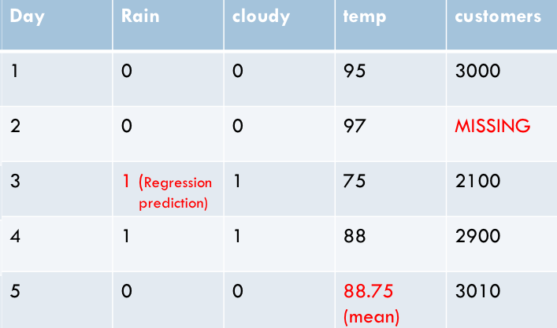
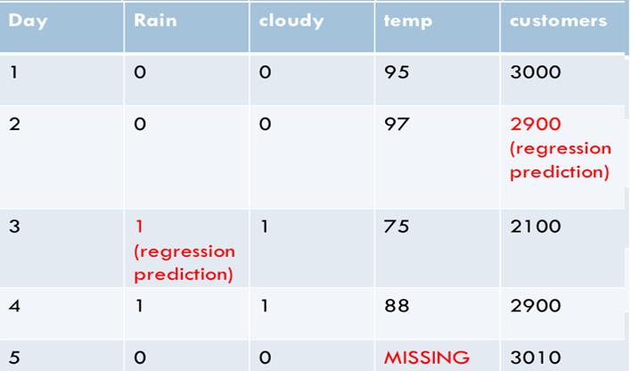
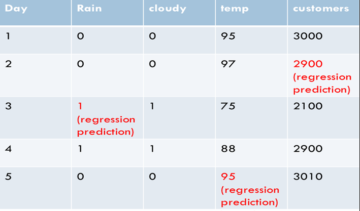
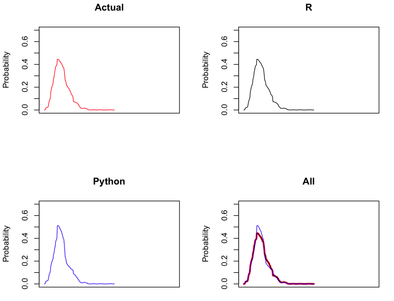
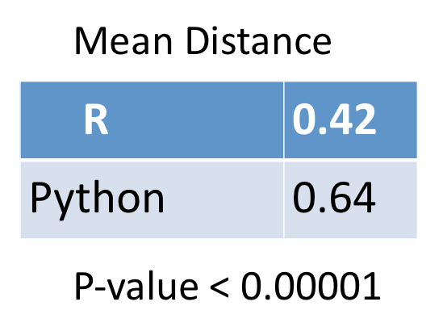
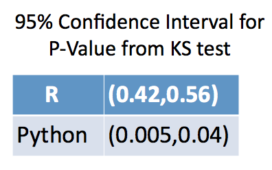

## The Problem of Missing Data 
Below is a partial data set used to predict sales at a hardware store for a month. The features are ***Rain (1=yes,0=no),Cloudy (1=yes,0=no),Temperature,Customers in a 24 hour period***. The features are used in an attempt to see how weather affects sales. Note that some of the data is flagged as missing. A predictive model cannot be built if we do not fill in the missing data with values. Also, because collecting data takes time and money, we dont want to toss the data out. What values should we use to fill in the missing data?

  

## Impute Missing Data
The term for guessing/replacing a value for the missing data is **imputation**. A simple imputation method is to calculate the mean or the median of a column that has missing data and then set all the missing data in that column to the value of the calcuation. Of course, the calculation is only performed on the values in the column that are *not missing*. Although this method is used all the time, it has some flaws. A major flaw is it artificailly reduces the variance. This can decrease the size of confidence intervals which can lead to making poor inferences. 
## MICE
MICE is an acronym for *Multivariate Imputation by Chained Equations*. It is an algorithm that relies on regression methods to perform imputations. Below we provide a high level/stepwise description of how MICE works.  
   ### *Step 1*
   Below is the partial dataset with only features. We use the *mean impute* method on all the missing values except 1. This is illustrated in step 2.  

  

  
  ### *Step 2*
  In the dateset below, the missing values in *Customer* and *Temperature* have been replaced with the column mean. The missing value in 
  *Rain* was left *missing*. Now *Rain* can be imputed using a regression method. This is illustrated in step 3. 

  

### *Step 3*
  In this step, the regression prediction replaced the missing value in *Rain*. Also, the mean impute in *Customers* has been set back to *Missing*. Note that *Temperature* was left alone. A regresson is run the imputes a new value for the missing value in *Customers*. This is shown in step 4. 

  

### *Step 4*
  In this step, the regression prediction replaced the missing value in *Customers*. Also, the mean impute in *Temperature* has been set back to *Missing*. Note that *Rain* was left alone. A regresson is run the imputes a new value for the missing value in *Temperature*. This is shown in step 5. 

  

 
 ### *Step 5*
  In this step, the regression prediction replaced the missing value in *Temperature*. All the missing values have been replaced by a regression impute. This is run several times. For example, *Customers* might be set to *Missing* again and the regression rerun. Then *Rain* is reset. Etc. The process can go on for several iterations. This leads to imputed values that do not cause problems with variance reduction and so on. 

  

  ### Repeat the Steps from the top. 
  When the steps are repeated, a new dataset is created with a new set of imputed values. The repeat process is done several time. The default for R is 5. A model is built on each of these data sets and the results are combined. The rules for combining to models are decribed by a paper from 1987 by Rubin. A copy of the paper can be found in the repo. The title is *Rubin's Rules*. Luckily, R and Python have functions that do all the calculations described in *Rubin's Rules*.     
  
  # Goal: Compare the R and the Python (from the fancyimpute package) implementation of MICE
  
  - Now that we have described the MICE algorithm, we can get to the goal of the project. We want to evaluate two implemenatations of  MICE. One implemenatation is written for R. It has been around since 2000. The other implementation is written for Python. It is much more recent than the R version.

# Implementation and Analysis

- A good imputation process will replace missing values with data that comes from the distrubution that the observed (non-missing) data comes from. We will compare the two versions of MICE with this in mind. Our analysis will use mathematical and visual comparison processes to see how well the imputations mimic the distribution of the observed data. 
- To test, we simulated data with binary, poisson, ordinal and normal data. We wanted to see how well the imputed data matched the 'actual' i.e. simulated data. We decided to process all normal data such that it skewed to the right or left. We wanted continuous data with some variety in shape. 
Each set of simulated data had 10 columns. We did some calculations and found that there are 84 different ways to mix the four datatypes. For example, one combination might be 2 poisson (2p), 3 binary (3b), 2 ordinal (2o) and 3 normal (3n). Another might be 4p, 4b, 1b and 1n. Etc. This leads to 84 different combinations. Also, the probabilties for the binary and ordinals can vary. The mean for the poisson can vary as can the mean and the standard deviation for the normal. Another variable is the correlation matrix used for each simulation. We decided to simulate 168 sets of data - 2 for each of the 84 combinations.  
- We found that Python Mice does not handle discrete data well. It imputes fractional values for binary, ordinal and poisson data. On the other hand, R Mice imputes data with the correct data type. Since Python essentially fails when imputing descrete data, we decided there was no need to go further. That is, we did not perform a statistical analysis comparing R and Python for descrete data.
- We performed extensive statistical analysis in our comparison of how R and Python MICE handle continuous data. We compared density curves visually and numerically. Below are visual comparisions (plots).

  

- The plots show the density of the actual values, R imputes, Python imputes and all three on top of each other. The Python data appear to over-sample near the peak of the distrubution. The R and the actual data appear to have the same distribution. This phenomnon was seen in a large portion of the density curves. 

- To do the numeric comparisions, we used techniques from functional data analysis (we used the R package fdasrvf) to calculate a metric used to measure how simular two density curves (i.e. functions) are to each other. We compared the density curves of the Python and the R imputations to the actual values they replaced. We had enough data to perform a t-test. The results are shown in the table below.

  

The results in the table above show that the R density curve is 'closer' to the actual data density than the Python density curve. Since we performed a t-test, we also have a p-value that indicates statistical significance.

- We also performed Kolmogorov–Smirnov (KS) tests on the distributions. The KS test is used to see if two sample distributions are the same.  We ran a total of 75 KS-Tests for R v Actual and 75 KS-Tests for Python v Actual. The results are in the table below.

  

The table reports the 95% confidence interval for the p-value calculated by the KS-test. The null value for the KS-test assumes that distribution A = distribution B. We compared R imputed data to the actual data and the Python imputed data to the actual data. Per results, we can reject the null hypothesis for the Python data and we cannot reject the null for the R data.

- Based on our results, we conclude that the R version of MICE does a very good job of imputing data that matches the distribution of the observed values. On the other hand, the Python version of MICE does not do well at this task. R has a better implementation of MICE than Python does. 

# Next Step(s)
 
 - We want to see how the imputations perform in models. We will compare models with no imputed data, models with a mix of imputed/observed and models with some imputed data on each row. We will do this for R and Python. 
